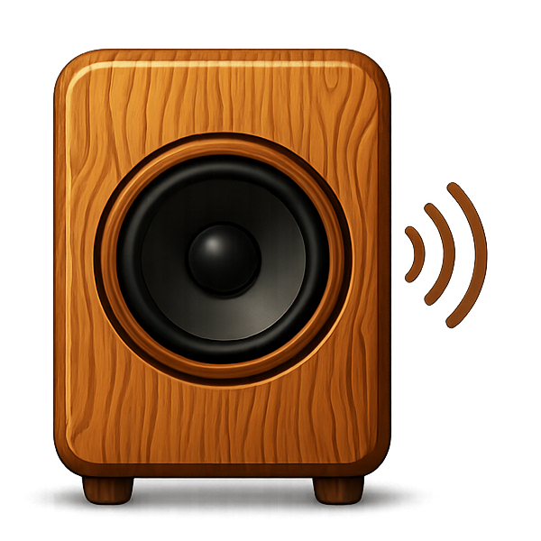

# SilentBeep

  

  <b>SilentBeep</b> — Keep your speakers awake

  
  
  

  <a href="README.md">English</a> | <a href="README.ru.md">Русский</a>

SilentBeep is a Windows utility that prevents speakers from auto-sleeping by periodically emitting inaudible audio pulses.

## Why?

Many audio devices — wired or wireless — enter sleep mode or power off after a period of inactivity, causing delays when you need to play sound. This behaviour is often driven by energy efficiency regulations that require devices to enter low-power standby mode after a reasonable time of inactivity.

SilentBeep keeps your audio device awake by playing ultra-low frequency pulses that are inaudible to humans.

## Features

- **Silent Operation** — uses frequencies below human hearing range (10 Hz by default).
- **System Tray** — runs in the background with a tray icon.
- **Auto-start** — optionally launch with Windows.
- **Customizable** — adjust interval, frequency, and duration, i18n, themes.
- **Device Selection** — choose which audio device to use.
- **Startup Jingle** — plays a pleasant 3-note sound on launch.
- **Night Mode** — optionally pause beeps during specified nighttime hours.

## Download & Installation

1. Download `SilentBeep-win-Setup.exe` from the [Releases](https://github.com/dosoft/SilentBeep/releases) page.
2. Run the installer. It installs per-user into `%LocalAppData%\SilentBeep\` and requires no UAC prompt.
3. SilentBeep starts automatically once installed and from every Windows login (autostart is enabled by default; you can disable it in Settings).

Windows SmartScreen may warn about an unsigned publisher. Click **More info → Run anyway** to proceed.

On first launch, you'll hear a 3-note jingle indicating the app is working. The app will appear in your system tray.

## Usage

SilentBeep runs in the system tray (bottom-right corner of your screen):

- **Left-click** — toggle keep-alive pulses on/off.
- **Double-click** — open settings window.
- **Right-click** — open context menu (settings, updates, exit).

Configure pulse behaviour, audio device selection, autostart, night mode, and view runtime status in the Settings window.

## Auto-Updates

SilentBeep checks GitHub Releases for a new version every 6 hours in the background (the first check happens 30 seconds after startup). When a new version is available it is downloaded silently and applied automatically at the next launch.

You can check for updates manually from the tray menu. When an update is downloaded, the tray menu shows **Restart to apply update**; a tray balloon also offers to restart immediately.

Automatic update checking can be disabled in Settings. Even when enabled, updates are downloaded but **never applied without your explicit restart**.

## Troubleshooting

**I don't hear anything when the app starts**

The startup jingle plays on the selected audio device. If you don't hear it, check that the correct device is selected in Settings.

**The pulse is audible**

- Lower the frequency to 5–10 Hz.
- Reduce the duration to 1–5 ms.

**App isn't keeping my speakers awake**

- Check that **Enabled** is turned on in Settings.
- Verify the correct audio device is selected.
- Try reducing the interval to a lower value for testing.

## Configuration & Logs

Settings are stored in `%APPDATA%\SilentBeep\config.json`. This file is intentionally placed in the roaming profile (not the install directory), so it survives uninstall and reinstall. You can edit it manually, but using the settings window is recommended.

Log files are written to `%LocalAppData%\SilentBeep\logs\` and rotated daily (up to 7 days kept). Include them when reporting issues.

## Privacy

SilentBeep does **not** collect any telemetry, analytics, or usage data.

The app makes outbound network requests only for one purpose: checking the GitHub Releases API (`api.github.com`) every 6 hours for new versions. Only anonymous HTTP(S) traffic is used — no user-identifiable information is sent.

## System Requirements

- Windows 10 or later.

## License & Support

SilentBeep is licensed under the [MIT License](LICENSE).

If you encounter issues or have suggestions, please [open an issue](https://github.com/dosoft/SilentBeep/issues).
